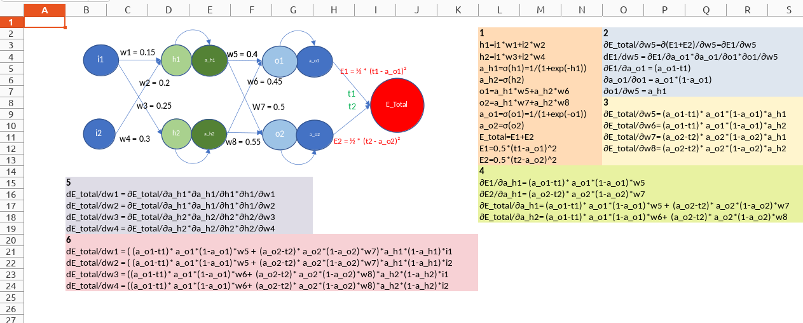

# backpropagation_excelsheet_wk6_era
Backpropagation calculations on excel sheet. 

The excel file has a simple neural network along with various mathematical formulas related to backpropagation and weight updates.

## Overview of the Neural Network:

- Input Layer: There are two input features, labeled as i1 and i2 nodes.
- Hidden Layer: The hidden layer has two neurons labeled as h1 and h2. The connections between the input and hidden layers have associated weights w1, w2, w3 and w4.
- Output Layer: Two output nodes are o1 and o2, showing the predicted values. The weights from the hidden layer to the output layer are labeled w5, w6, w7 and w8.
- Activation Functions: The hidden and output layers use sigmoid as activation function, as indicated by the sigma symbol.
- Errors: The outputs have errors E1 and E2 which are calculated with the help of predicted (o1, o2) and target (t1, t2) values, which are part of the total error E_Total.

## Neural Network Formulae
The image above shows colored blocks numbered from 1 to 6. 
- Block 1: It gives association of different parameters from input layer to the final error.
- Block 2: Relations for the partial derivative of final error and associated parameters. 
- Block 3: The partial derivative of the final error wrt the weights w5, w6, w7 and w8. These are useful in update of the weights and in block-4.
- Block 4: Intermediate partial derivatives of the error wrt parameters a_h1 and a_h2 to be used in block-5.
- Block 5: Partial derivatives of the final error wrt weights w1, w2, w3 and w4.
- Block 6: Expansion of block-5 formulae by using block-4.

### Gradient Descent Weight Update Rule for all weights:

w_i(new) = w_i(old) - LearningRate * ∂E_Total/∂w_i
